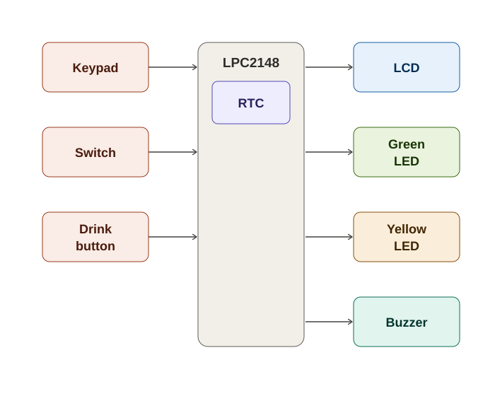

💧 AquaGuardian – Smart Water Drinking Reminder System
A real-time embedded hydration reminder system developed using the LPC2148 ARM7 microcontroller.

Stay Hydrated • Smart Reminders • Simple Control

📌 Project Overview
AquaGuardian is an embedded healthcare application designed to help users maintain proper hydration throughout the day.

The system uses an RTC (Real-Time Clock) to maintain the current date and time and continuously compares it against a configured reminder interval. When it's time to drink water, the LCD displays a reminder message, the Yellow LED lights up, and the buzzer sounds an alert.

The system also provides a Configuration Mode through an external interrupt. Pressing the Switch lets the user access a menu-driven interface using the 4×4 keypad to update the RTC date/time or the daily hydration goal.

🎯 Objectives
🕒 Display the current date and time using the RTC
⏱️ Generate automatic reminders for drinking water at a configured interval
🥤 Allow the user to record each glass of water consumed using the Drink button
🎯 Maintain and display a configurable daily water intake goal
📺 Display the number of glasses consumed and the remaining daily target on the LCD
🚦 Indicate hydration status using Green and Yellow LEDs
🔊 Provide an audible alert using a buzzer
🔐 Provide a protected Configuration Mode using an external interrupt switch
✏️ Allow authorized modification of RTC settings and the hydration goal
🌙 Automatically reset the daily water intake records at midnight
🧩 Block Diagram

⚙️ System Working
The system works mainly in two modes: Normal Mode and Configuration Mode.

🟢 Normal Mode
Initializes the required hardware peripherals — LCD, RTC, keypad, buzzer, and interrupt system.
Reads and maintains the current time from the RTC.
Continuously compares the current time with the next scheduled reminder.
When the reminder time is reached, lights the Yellow LED, sounds the buzzer, and displays a message on the LCD.
Repeats the alert until the user presses the Drink button to acknowledge it.
On acknowledgment, increments the glass counter, updates the LCD with glasses consumed and remaining, and schedules the next reminder.
Lights the Green LED once the daily hydration goal is achieved.
At midnight, resets the glass counter and status indicators while retaining the configured daily goal.
🔐 Configuration Mode
Activated through the Switch connected to the microcontroller's external interrupt pin.
The interrupt service routine sets the Configuration Mode flag.
The user navigates the menu using the keypad.
The user can choose to edit the RTC date/time or the daily hydration goal.
Entered values are validated and stored before returning to Normal Mode.
Normal reminder monitoring resumes without needing a system restart.
🔧 Hardware Requirements
Component	Purpose
LPC2148	Main ARM7 microcontroller
16×2 LCD	Displays time, hydration status, and menu information
4×4 Matrix Keypad	User input for Configuration Mode
RTC	Maintains real-time date and time
Green LED	Daily hydration goal achieved
Yellow LED	Reminder — time to drink water
Buzzer	Audio alert
Switch	External interrupt to enter Configuration Mode
Drink Button	External interrupt to log a glass of water
USB-UART Converter / DB-9 Cable	Serial communication / programming support
💻 Software & Tools
Tool / Technology	Purpose
Embedded C	Application programming
Keil µVision	Embedded C development and compilation
Flash Magic	LPC2148 programming / flashing
LPC2148	Target microcontroller
ARM7TDMI-S	Processor architecture
✨ Key Features
🕒 Real-Time Tracking — Maintains the current date and time using the RTC
⏱️ Scheduled Reminders — Automatically triggers a reminder at the configured interval
🥤 Intake Logging — Records each glass consumed via the Drink button
📺 LCD Information Display — Shows time, glasses consumed, and remaining target
🚦 LED Indication — Green for goal achieved, Yellow for reminder due
🔊 Buzzer Alert — Audible notification when a reminder is triggered
🔐 Interrupt-Based Configuration — Switch-triggered menu for settings
✏️ Configurable Goal — Daily hydration target can be edited via keypad
🌙 Automatic Daily Reset — Resets intake counters at midnight while keeping the goal
🧠 Key Implementation Concepts
🕒 RTC-Based Time Comparison — Compares the current RTC time with the scheduled reminder
⚡ External Interrupt Handling — Uses separate interrupts for the Switch (Configuration Mode) and Drink button (intake logging)
🔐 Menu State Handling — Controls the stages of the Configuration Mode menu
🥤 Intake & Progress Calculation — Tracks glasses consumed and recalculates hydration progress
✅ Input Validation — Checks entered RTC and goal values before saving
🧩 Modular Design — Separates application logic, drivers, and supporting modules
📂 Project Structure
AquaGuardian-Smart-Water-Drinking-Reminder-System/
│
├── main.c
│
├── aquaguardian.c
├── aquaguardian.h
│
├── rtc-1.c
├── rtc.h
│
├── lcd (1).c
├── lcd.h
│
├── kpm-1.c
├── kpm.h
│
├── interrupt-1.c
│
├── delay (1).c
├── types (1).h
│
├── aquaguardian_block_diagram.svg
│
└── README.md
🧩 Module Description
Module	Responsibility
main.c	Main application flow and overall system control
aquaguardian.c	Reminder scheduling, glass counting, and goal tracking
aquaguardian.h	AquaGuardian definitions
rtc-1.c	RTC initialization and time handling
rtc.h	RTC definitions
lcd (1).c	16×2 LCD driver and display operations
lcd.h	LCD function declarations
kpm-1.c	4×4 keypad scanning and key detection
kpm.h	Keypad definitions
interrupt-1.c	External interrupt configuration and ISR (Switch and Drink button)
delay (1).c	Delay generation
types (1).h	Data type definitions
🖥️ Simulation & Output
The system is designed around an LPC2148-based embedded controller with a 16×2 LCD, 4×4 keypad, RTC, status LEDs, buzzer, and an external Switch.

Main Output Behaviour

Current date and time are displayed through the LCD.
Glasses consumed and remaining target are shown continuously.
The Yellow LED and buzzer activate when a reminder is due.
The Green LED activates once the daily goal is achieved.
Configuration Mode temporarily takes over the display when the Switch interrupt is triggered.
🛠️ Development
Microcontroller: LPC2148
Architecture: ARM7TDMI-S
Programming Language: Embedded C
IDE: Keil µVision
Programming Tool: Flash Magic
⭐ Project Highlights
Real-Time • Reliable • Simple • Modular

The project combines RTC-based scheduling, hydration tracking, keypad input, LCD interfacing, external interrupt handling, LED status indication, and buzzer alerts into a single compact embedded healthcare solution.

📈 Future Enhancements
Add EEPROM/Flash logging to retain hydration history across power cycles Add a Red LED to indicate missed reminders or significant backlog against the daily target Add Bluetooth/Wi-Fi connectivity to synchronize hydration data with a mobile application Support multiple user profiles with individual daily hydration goals

👤 Author
Dhadi Ashwini

